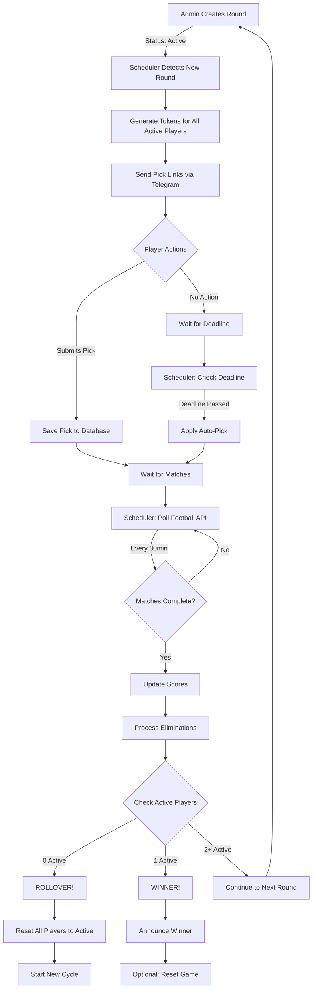

# 🔄 LMS Automation - Complete Flow Diagram

## Game Lifecycle Flow



## Detailed Component Interactions

### 1. **Round Activation Flow**
```
Admin Dashboard (Web)
    ↓ Creates Round
Flask App (app.py)
    ↓ Sets status='active'
Database
    ↓ Round saved
Scheduler (every hour)
    ↓ Detects active round
generate_round_tokens()
    ↓ Creates tokens
Telegram Bot
    ↓ Sends pick links
Players' Telegram
```

### 2. **Pick Submission Flow**
```
Player's Telegram
    ↓ /pick TOKEN
Telegram Bot API
    ↓ GET /api/picks/options/TOKEN
Flask App
    ↓ Returns available teams
Telegram Bot
    ↓ Shows team buttons
Player clicks team
    ↓ POST /api/picks/submit
Flask App
    ↓ Saves pick
Database
    ↓ Pick recorded
Telegram Bot
    ↓ Confirms to player
```

### 3. **Reminder Flow**
```
Scheduler (every 15 min)
    ↓ Checks scheduled_time
send_due_reminders()
    ↓ Finds due reminders
For each reminder:
    ├─ Has telegram_id?
    │   ↓ Yes
    │   Telegram API
    │   ↓ Send message
    │   Player receives
    │
    └─ No telegram_id?
        ↓
        WhatsApp link generated
        ↓ (Manual step)
        Admin sends
```

### 4. **Elimination & Rollover Flow**
```
Scheduler (every 30 min)
    ↓
update_fixture_results()
    ↓ Calls Football API
    ↓ Gets match results
    ↓ Updates database

process_eliminations() (every hour)
    ↓ For each completed fixture
    ↓ Mark picks as won/lost
    ↓ Eliminate losers
    ↓
Check game state:
    │
    ├─ 0 Active Players (ROLLOVER!)
    │   ↓
    │   Player.query.update({'status': 'active'})
    │   ↓
    │   Send rollover notification to all
    │   ↓
    │   Increment cycle_number
    │   ↓
    │   Continue game
    │
    ├─ 1 Active Player (WINNER!)
    │   ↓
    │   Mark as winner
    │   ↓
    │   Send winner announcement
    │   ↓
    │   Game ends (or reset)
    │
    └─ 2+ Active Players
        ↓
        Continue to next round
```

## 🎮 Testing Scenarios

### Scenario 1: Normal Round
```bash
# 1. Create round with 3 fixtures
# 2. Register 5 players
# 3. 3 pick winning teams, 2 pick losing
# Expected: 2 eliminated, 3 continue
```

### Scenario 2: Rollover Test
```bash
# 1. Create round with 2 fixtures
# 2. Register 4 players
# 3. All pick losing teams
# Expected: All eliminated → Rollover → All active again
```

### Scenario 3: Winner Test
```bash
# 1. Create round
# 2. Register 2 players
# 3. 1 picks winner, 1 picks loser
# Expected: Winner declared, game ends
```

### Scenario 4: Missed Deadline
```bash
# 1. Create round with short deadline
# 2. Register players but don't pick
# 3. Wait for deadline
# Expected: Auto-picks applied
```

## 📊 Database State During Rollover

### Before Rollover:
```sql
SELECT * FROM players;
-- id | name    | status      | telegram_id
-- 1  | John    | eliminated  | 123456
-- 2  | Jane    | eliminated  | 123457
-- 3  | Bob     | eliminated  | 123458
-- (0 active players)
```

### Rollover Triggers:
```python
if Player.query.filter_by(status='active').count() == 0:
    Player.query.update({'status': 'active'})
    db.session.commit()
```

### After Rollover:
```sql
SELECT * FROM players;
-- id | name    | status  | telegram_id
-- 1  | John    | active  | 123456
-- 2  | Jane    | active  | 123457
-- 3  | Bob     | active  | 123458
-- (All active again!)

SELECT * FROM rounds;
-- Last round: cycle_number = 1
-- New round will be: cycle_number = 2
```

## 🔍 Monitoring Commands

### Check System Status:
```bash
# See all running processes
ps aux | grep -E "app.py|scheduler|bot.main"

# Check scheduler jobs
curl http://localhost:5000/api/scheduler/status

# View recent picks
curl http://localhost:5000/api/picks-grid-data

# Check active players
sqlite3 lms_automation/lms.db "SELECT COUNT(*) FROM players WHERE status='active';"
```

### Watch Logs in Real-Time:
```bash
# If using screen
screen -r lms_scheduler

# If logging to file
tail -f scheduler.log

# Watch all Python processes
watch -n 1 'ps aux | grep python'
```

## 🚨 Emergency Controls

### Force Rollover Manually:
```python
# Emergency rollover script
from lms_automation.app import app
from lms_automation.models import db, Player

with app.app_context():
    print(f"Active: {Player.query.filter_by(status='active').count()}")

    # Force rollover
    Player.query.update({'status': 'active'})
    db.session.commit()

    print("✅ Manual rollover complete!")
```

### Stop Everything:
```bash
# Kill all LMS processes
pkill -f "app.py"
pkill -f "scheduler"
pkill -f "telegram_bot"
```

### Reset Database:
```bash
cd lms_automation
rm lms.db
python3 -c "from lms_automation.app import app; from lms_automation.extensions import db; app.app_context().push(); db.create_all()"
```

## ✅ Success Checklist

Before going live, verify:

- [ ] Bot responds to /start
- [ ] Players can register
- [ ] Tokens generate automatically
- [ ] Picks can be submitted
- [ ] Reminders are sent
- [ ] Fixtures update from API
- [ ] Eliminations process correctly
- [ ] Rollover works when all eliminated
- [ ] Winner detected when 1 remains
- [ ] System runs 24/7 without crashes

## 🎯 Go Live Steps

1. **Test with friends first** (5-10 players)
2. **Run for 1 complete round** to verify
3. **Check rollover works** (simulate if needed)
4. **Deploy to home server**
5. **Set up monitoring alerts**
6. **Go live with real players!**

The system is now FULLY AUTOMATED and will handle everything including rollovers! 🎉
